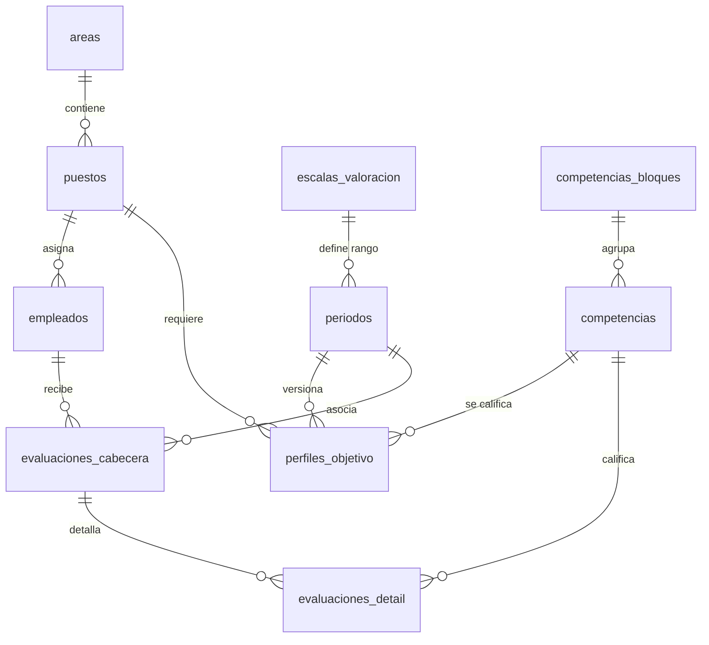

# Especificaciones Técnicas y de Negocio — Gestor de Competencias ERP
> **Documento de Contexto Maestro y Especificación Técnica (Spec)**  
> **Propósito:** Mantener la fidelidad absoluta de la arquitectura, reglas matemáticas, persistencia y UI del aplicativo para auditorías y sesiones de desarrollo futuras.  
> **Estado del Sistema:** 100% Completado y Contenedorizado.

---

## 📌 1. Arquitectura y Estructura de Directorios

El aplicativo sigue de forma estricta los principios de **Clean Architecture** y la separación de responsabilidades:

```
efiempresa-test/
├── config/
│   └── database.php          ← Configuración dinámica con getenv() y fallbacks
├── database/
│   ├── schema.sql            ← Creación de tablas, índices y limpieza idempotente
│   └── seed.sql              ← Semillas de datos maestros para pruebas
├── docker/
│   └── entrypoint.sh         ← Script de entrada defensivo con espera activa via netcat
├── docs/
│   ├── skills/               ← Reglas de Clean Arch, PHP/MySQL, Frontend y Git
│   └── spec.md               ← Este archivo de especificaciones maestro
├── public/
│   ├── css/                  ← Estilos Bootstrap 5 y semáforos personalizados
│   ├── js/                   ← Controladores dinámicos SPA y caché O(1)
│   ├── views/                ← Vistas HTML de catálogo, evaluación, matriz y ficha
│   └── index.php             ← Front Controller y despachador de rutas del Router
├── scripts/
│   └── install_db.php        ← Script automatizado de migración de base de datos
├── src/
│   ├── Controllers/          ← Controladores desacoplados de la lógica de presentación
│   ├── Services/             ← Lógica matemática de negocio y estrategias
│   ├── Repositories/         ← Implementaciones PDO y Queries indexadas
│   └── Core/                 ← Conexión Singleton, Router central y Contenedor DI
├── Dockerfile                ← Compilación Alpine con PDO MySQL y utilidades de red
└── docker-compose.yml        ← Composición multi-contenedor de red interna bridge
```

---

## 🗄️ 2. Persistencia y Especificaciones de Base de Datos (MySQL 8.0)

El modelo relacional consta de **10 tablas** organizadas en tres bloques conceptuales, asegurando inmutabilidad histórica e integridad referencial.



### 2.1 Tablas Maestras del ERP (Simuladas)
*   **`areas`**: Departamentos corporativos. Columnas: `id`, `nombre`, `descripcion`, `activo` (1/0).
*   **`puestos`**: Cargos vinculados a un área. Columnas: `id`, `area_id` (FK), `nombre`, `activo`.
*   **`empleados`**: Datos de colaboradores. Columnas: `id`, `area_id` (FK), `puesto_id` (FK), `nombre`, `apellidos`, `email` (UNIQUE), `activo`.

### 2.2 Tablas de Configuración
*   **`escalas_valoracion`**: Límites configurables del periodo. Columnas: `id`, `nombre`, `valor_min` (ej. 1.00), `valor_max` (ej. 5.00), `activo`.
    -   *Constraint:* `CHECK (valor_max > valor_min)`
*   **`periodos`**: Ciclos temporales de evaluación. Columnas: `id`, `escala_id` (FK), `nombre`, `fecha_inicio`, `fecha_fin`, `activo`, `cerrado` (1/0).
    -   *Constraint:* `CHECK (fecha_fin >= fecha_inicio)`
*   **`competencias_bloques`**: Familias competenciales. Columnas: `id`, `nombre`, `orden`, `activo`.
*   **`competencias`**: Habilidades evaluadas. Columnas: `id`, `bloque_id` (FK), `nombre`, `descripcion`, `activo`.

### 2.3 Tablas Operativas de Evaluación
*   **`perfiles_objetivo`**: Perfil ideal requerido por cargo y periodo. Columnas: `id`, `puesto_id` (FK), `competencia_id` (FK), `periodo_id` (FK), `valor_ideal` (DECIMAL), `peso` (expectativa porcentual, 0-100).
    -   *Llave Única:* `UNIQUE KEY (puesto_id, competencia_id, periodo_id)` (Previene duplicaciones y permite versionar los ideales entre periodos sin pisar históricos).
*   **`evaluaciones_cabecera`**: Puntuación y ajuste global. Columnas: `id`, `empleado_id` (FK), `periodo_id` (FK), `puesto_id` (FK), `porcentaje_ajuste` (persistido), `evaluado_por`.
    -   *Llave Única:* `UNIQUE KEY (empleado_id, periodo_id)`
*   **`evaluaciones_detalle`**: Desglose calificado por competencia. Columnas: `id`, `cabecera_id` (FK ON DELETE CASCADE), `competencia_id` (FK), `puntuacion`, `gap`, `semaforo` (ENUM 'verde','amarillo','rojo'), `comentario`.
    -   *Llave Única:* `UNIQUE KEY (cabecera_id, competencia_id)`

---

## 🧮 3. Reglas de Negocio y Núcleo Matemático

### 3.1 Cálculo del GAP y Capping Matemático
La brecha individual (GAP) entre la calificación real de un empleado y el valor esperado por su cargo se calcula como:
$$GAP = Puntuaci\acute{o}n\ Real - Puntuaci\acute{o}n\ Ideal$$

*   **Tope (Capping) de Rendimiento:** Si el colaborador obtiene una puntuación superior a la ideal ($Real > Ideal$), el GAP da un valor positivo (ej: $+1.00$). Si este valor positivo fuera promediado de forma directa, ocultaría deficiencias críticas en otras competencias. Por lo tanto, en la lógica del porcentaje de ajuste global, se aplica una regla de tope:
    $$\text{Puntuación Capped}_i = \min(\text{Real}_i, \text{Ideal}_i)$$
*   **Conservación de Historial:** A pesar del capping en el cálculo del promedio global, el valor real real obtenido ($5/4$) se conserva intacto en la base de datos y se expone visualmente en la línea de tiempo de crecimiento individual para la toma de decisiones de desarrollo y talento.

### 3.2 Porcentaje de Ajuste Global Ponderado
El porcentaje de ajuste de un colaborador frente a su puesto para un periodo determinado se pondera en función de los pesos específicos asignados en el perfil objetivo de su puesto:
$$\text{Ajuste Global \%} = \frac{\sum_{i=1}^{n} \left( \min(\text{Real}_i, \text{Ideal}_i) \times \text{Peso}_i \right)}{\sum_{i=1}^{n} \left( \text{Ideal}_i \times \text{Peso}_i \right)} \times 100$$

### 3.3 Estrategia de Colorización de Semáforos
Basado en el patrón **Strategy**, el semáforo se calcula de forma porcentual en la clase `SemaforoPorcentualStrategy` en base a la relación de cumplimiento:
$$\% \text{Cumplimiento} = \frac{\text{Real}}{\text{Ideal}} \times 100$$

*   🟢 **Verde (`semaforo--verde`):** Cumplimiento $\ge 85\%$.
*   🟡 **Amarillo (`semaforo--amarillo`):** Cumplimiento entre $60\%$ y $84.99\%$.
*   🔴 **Rojo (`semaforo--rojo`):** Cumplimiento $< 60\%$.

### 3.4 Inmutabilidad de Periodos Cerrados
Cuando la columna `periodo.cerrado` es igual a `1`, el sistema activa guardas de excepción a nivel de persistencia en `EvaluacionService`. Cualquier operación de inserción, actualización o eliminación en evaluaciones asociadas a ese periodo lanzará un error de dominio de inmediato, garantizando la inalterabilidad histórica de las auditorías de rendimiento.

---

## 📡 4. Contratos de API (Rutero Central HTTP)

Todos los endpoints asíncronos interactúan estrictamente mediante intercambio de payloads estructurados en formato **JSON**:

| Método | Endpoint | Parámetros | Propósito / Respuesta |
|---|---|---|---|
| **GET** | `/api/evaluacion` | `empleado_id`, `periodo_id` | Carga el formulario One-to-One con calificaciones previas, ideales de puesto y escala del periodo. |
| **POST** | `/api/evaluacion` | Payload JSON | Guarda o actualiza transaccionalmente la evaluación y devuelve el `% de ajuste global` recalculado y los semáforos. |
| **GET** | `/api/matriz` | `periodo_id`, `area_id` | Devuelve la grilla bidimensional de rendimiento (empleados vs competencias) optimizada para evitar problemas N+1. |
| **GET** | `/api/ficha` | `empleado_id` | Devuelve la trayectoria histórica del colaborador agrupada por periodos de evaluación. |
| **GET** | `/api/test-db` | Ninguno | Diagnóstico rápido. Conecta con el Singleton PDO y retorna la versión del motor MySQL. |

---

## 💻 5. Interfaces y Optimización Frontend (SPA Dinámico)

Las interfaces están desarrolladas con **Bootstrap 5** y lógica asíncrona nativa **Fetch API** sin recargas completas de pantalla.

### 5.1 Mitigación de Saturación de Bucle N+1 en Cliente
En la **Matriz Resumen por Equipo** (`public/js/matriz.js`), pintar una grilla bidimensional puede generar problemas de rendimiento si se ejecutan bucles anidados de búsqueda en arrays tradicionales. 

Para resolverlo con complejidad constante **$O(1)$**, implementamos un hash map de indexación en memoria:
```javascript
const scoresMap = {};
// calificaciones es el listado plano devuelto por la API unificada indexada
calificaciones.forEach(c => {
    if (!scoresMap[c.empleado_id]) scoresMap[c.empleado_id] = {};
    scoresMap[c.empleado_id][c.competencia_id] = {
        puntuacion: parseFloat(c.puntuacion),
        semaforo: c.semaforo
    };
});
```
Al renderizar las columnas de competencias por cada empleado, la celda recupera la información directamente mediante `scoresMap[empleadoId][competenciaId]`, asegurando renders inmediatos de grillas masivas.

---

## 🐳 6. Infraestructura, SRE y Dockerización

### 6.1 Inyección de Dependencias Recursiva (`Container.php`)
El core de la aplicación no depende de fábricas estáticas rígidas. El contenedor [`src/Core/Container.php`](../src/Core/Container.php) inspecciona recursivamente los parámetros del constructor de cualquier clase solicitada usando `ReflectionClass` e instancia e inyecta de forma automática los singletons de base de datos y repositorios requeridos en tiempo de ejecución.

### 6.2 Composición de Orquestación docker-compose
El entorno cuenta con dos servicios enlazados en una red bridge:
*   `vasalto_competencias_db` (MySQL 8.0 en el puerto 3306).
*   `vasalto_competencias_app` (PHP 8.2 Alpine en el puerto 8000).

El contenedor de la aplicación ejecuta el script `docker/entrypoint.sh` el cual espera defensivamente la disponibilidad física del puerto de MySQL utilizando un bucle `netcat` (`until nc -z -w 2 db 3306; do sleep 2; done`). Una vez conectado, ejecuta la limpieza de tablas y migración idempotente de semillas a través de `install_db.php`, y finalmente arranca el servidor web.
